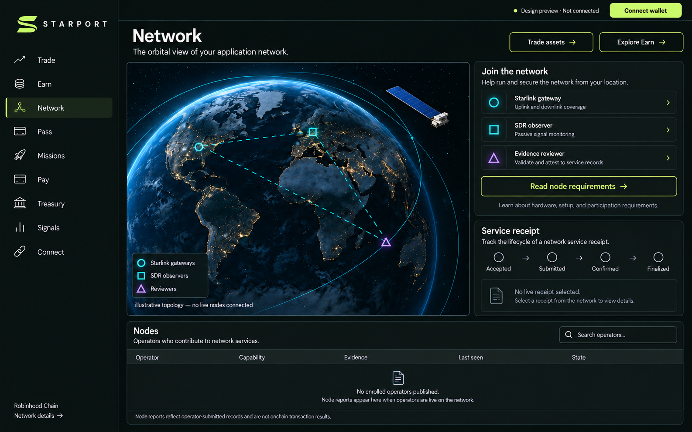

# Starport Protocol

**Website:** [starport.nexus](https://starport.nexus) · [Implementation map](docs/implementation-status.md) · [Earn](docs/earn-implementation.md) · [Pay & Trade](docs/execution-implementation.md)

Project token: **SPORT** (contract pending deployment).


Starport is a proposed Starlink-connected application network for RWA access, limited transaction tasks, and inspectable service receipts.

## Current status
This repository contains runnable node/SDK packages and five undeployed contract implementations: fee collection, isolated SPORT delegation, funded rewards, invoice/direct payments and bounded exact-input trades. The [implementation map](docs/implementation-status.md) separates these from missing venue, eligibility and hosted-service integrations. This is source-level implementation, not a deployed or independently audited financial service.

## Product modules
Network is the default home (`/` leads to `/network`). All nine modules remain available. The proposed launch quote asset is native ETH, revenue is recorded in wei, and the creator-tax target is 100 bps (1%); these are design requirements, not claims about a live deployment.

| # | Module | Responsibility | App route |
| --- | --- | --- | --- |
| 1 | Trade | Stock Token markets, conditional orders, positions, and execution receipts | /trade |
| 2 | Earn | Node delegation, funded reward epochs, claims, and exits | /earn |
| 3 | Network | Enrollment and service records for Starlink gateways, SDR observers, and evidence reviewers | /network |
| 4 | Pass | Account identity, service quotas, contributions, and delegation history | /pass |
| 5 | Missions | Budgeted relay, observation, review, and product-contribution tasks | /missions |
| 6 | Pay | Payments, invoices, and receipts in USDG or subsequently approved assets | /pay |
| 7 | Treasury | ETH revenue sweeps, claims, reconciliation, budgeting, and reward funding | /treasury |
| 8 | Signals | Alerts for market data, orders, corporate actions, revenue, and node anomalies | /signals |
| 9 | Connect | An API, SDK, and webhook workspace for external wallet and application integrations | /connect |



The image is an application design preview, not a live network screenshot.

## Open protocol scope
- Amounts, assets, market context and receipt schemas
- Node capabilities, enrollment and service-state contracts
- Public API design and an implemented read-only SDK
- Treasury and reward accounting invariants
- Bounded node-agent and opt-in Starlink capture packages
- Concrete DNS-pinned HTTPS probe transport and task-bound receipt verification
- Principal-exit and funded-reward contracts, with deterministic allocation manifests
- EIP-712 / ERC-1271 invoice settlement and a fixed-adapter exact-input trade boundary
- Fee-vault source, local tests and reproducible compiler inputs

The consumer application, authentication, indexing, operations and deployment orchestration are maintained separately in starport-app. The public repository is not a fabricated substitute for private runtime code.

## Start reading
- [Protocol overview](docs/overview.md)
- [Node and receipt design](docs/node-and-receipts.md)
- [Assets and rewards](docs/assets-and-rewards.md)
- [PONS / native ETH design](docs/pons-eth.md)
- [API contract](specs/openapi.json)
- [Contract boundaries](docs/contract-boundaries.md)
- [Repository boundary](docs/repository-boundary.md)

Starport is independent of SpaceX, Starlink, Robinhood and PONS. Factual protocol integration does not imply endorsement. Stock Token access and distribution remain subject to applicable eligibility requirements.


## R4 participation and contract design
- [Node admission, funded rewards and finite exits](docs/node-rewards-policy-r4.md)
- [Trade, payment and reward contract integration](docs/contract-integration-r4.md)

These are proposed policies and interface requirements, not live yield, active custody or deployed contract claims.

## Read-only catalog integration

The companion local application now implements configuration projections and an issuer-sourced Stock Token metadata directory. [Read-only catalog contract](docs/read-only-catalog.md) documents the bounded source, cache and pagination behavior. The remaining business operations are still designs/gated interfaces; this does not establish a live node fleet, tradable route or deployed SPORT contract.


## Build the public packages

Requires Node.js 22.12 or later and the pinned npm toolchain. This repository builds independently; the private application is not required.

```sh
npm ci --ignore-scripts
npm run build
npm run build:contracts
npm test
npm run test:contracts
npm run example:offline
```

The four workspace packages provide canonical operator messages and receipt verification, a bounded probe runner with an opt-in concrete HTTPS transport, an opt-in local terminal capture adapter and a read-only public API client. The build does not provision a database, contact terminal hardware, publish packages or deploy contracts. Contract tests require Anvil; the capture adapter requires a separately installed `grpcurl` and an authorized physical terminal. Financial signing is not provided by these packages.

See `docs/node-runtime.md` for the operator message scheme and runtime boundary. Package build uses the pinned TypeScript workspace; `npm run build` does not publish or deploy.
## R5.1 fee-vault implementation

The planned revenue route is SPORT/ETH → PONS Fee Escrow → StarportFeeVault. See [R5 design](docs/fee-vault-r5.md), [contract build](contracts/README.md), [permissions](contracts/PERMISSIONS.md) and [PONS source review](contracts/PONS-SOURCE-REVIEW.md). Controller, payout and Keeper addresses are preparation inputs, not deployed authority. The vault is not deployed; live binding and deployment checks remain outstanding. Native ETH reception and emergency ERC-20/native recovery are implemented, with recovery limited to the immutable payout address. The unsigned collection planner cannot sign or broadcast. Trade, Pay and reward custody now have separate source implementations; their production integrations and activation remain pending.

## License

MIT. Upstream attribution for adapted telemetry parsing is retained in `packages/starlink-operator/SKYRELAY-MIT.txt`.
